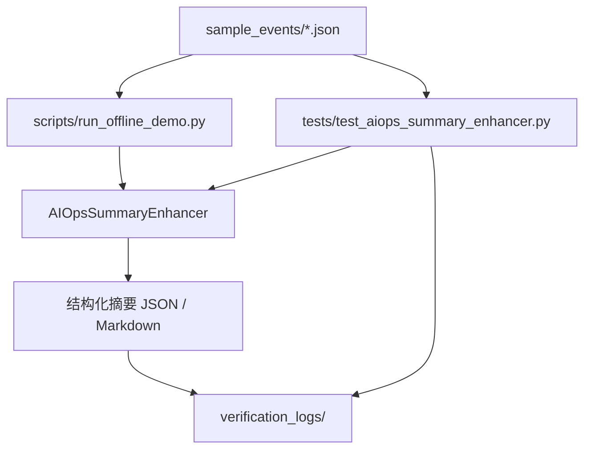

# 架构与 Agent 思路

## 真实场景

企业值班人员收到 `data-sync-service` 告警。面试验证时不接真实监控和日志平台，而是用 `sample_events/` 中的样例事件复现 Agent 的关键判断链路：

1. 输入 Agent 计划、工具观测结果或工具失败事件。
2. 提取影响服务、指标、日志证据和错误信息。
3. 判断风险等级和根因。
4. 生成风险/异常解释。
5. 自动给出下一步动作。

## 最小可验证架构



## Agent 状态流

本仓库用样例事件模拟完整 Agent 状态流：

```text
plan_created
  -> tool_observation
  -> report
  -> structured_summary
```

工具失败场景：

```text
plan_created
  -> error
  -> evidence_gap_summary
```

## 工具调用边界

本项目不直接调用生产系统，也不执行变更动作。工具边界在摘要中明确输出：

- 只通过工具读取知识库、日志和监控数据，不直接登录机器。
- 工具只负责查询；重启、扩容、回滚等变更动作必须人工确认。
- 报告必须引用工具证据；证据不足时输出不确定性和补查动作。

## AI 增强点接入思路

核心增强模块：

```text
ai_enhancement/aiops_summary_enhancer.py
```

输入是 Agent 事件和工具观测结果，输出是面试官可以直接检查的结构化摘要：

```text
Agent events / tool observations
  -> AIOpsSummaryEnhancer
  -> 影响服务 + 风险等级 + 根因 + 证据 + 风险解释 + 下一步动作
```

这个设计保留了 Agent 落地项目中最容易被面试追问的部分：状态流、工具边界、异常解释和可测试性。
