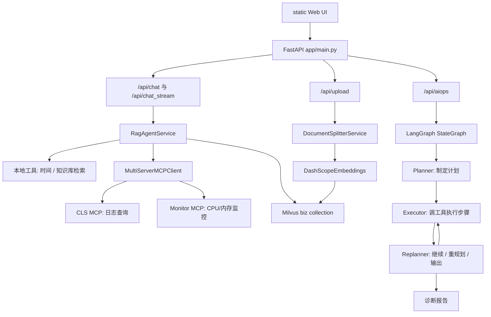

# 项目整体架构与 Agent 思路

## 真实场景

企业值班人员收到 `data-sync-service` 告警。传统处理方式需要人工打开监控、日志、历史工单和内部 SOP 文档。这个项目把这些动作变成 Agent 流程：

1. 先从知识库检索相关经验。
2. 再规划排查步骤。
3. 按步骤调用日志和监控工具。
4. 根据结果决定继续、重规划或生成报告。
5. 输出根因、证据、风险和处理建议。

## 总体架构



## Agent 状态流

核心状态在 `app/agent/aiops/state.py`：

```text
input       原始任务
plan        剩余执行计划
past_steps  已执行步骤和结果
response    最终报告
```

状态流在 `app/services/aiops_service.py` 中定义：

```text
planner -> executor -> replanner
                    -> executor 或 END
```

这个设计的重点是让 Agent 不只是“回答”，而是能“计划、执行、复盘”。Planner 负责把任务拆成步骤；Executor 只执行当前步骤；Replanner 根据已获得证据判断是否继续或输出。

## 工具调用边界

工具边界分成三类：

1. 本地工具：`retrieve_knowledge` 和 `get_current_time`。
2. MCP 日志工具：`search_topic_by_service_name`、`search_log` 等。
3. MCP 监控工具：`query_cpu_metrics`、`query_memory_metrics` 等。

边界原则：

- Agent 只查询，不直接变更生产系统。
- MCP 工具失败会被重试拦截器捕获。
- 最终报告必须基于工具证据，证据不足时需要说明不确定性。

## AI 增强点接入思路

本包新增的 `ai_enhancement/aiops_summary_enhancer.py` 可以接在 AIOps 报告生成后：

```text
AIOps events / tool observations
  -> AIOpsSummaryEnhancer
  -> 结构化摘要 + 风险解释 + 下一步动作
```

它不直接替换原 Agent，而是作为报告后处理层，使结果更适合值班交接、面试演示和接口测试。
